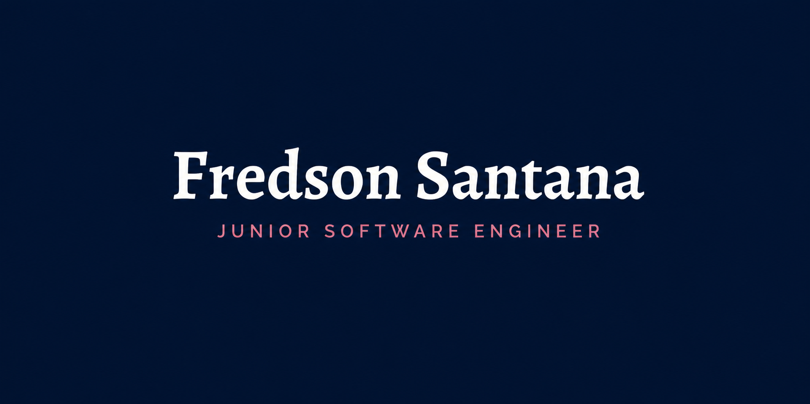

  

<section style="width: 100%; display: flex; justify-content: space-between; align-items: center;">
  
  
  
</section>

   

### 👋 Olá, eu sou o Fredson Santana Machado Filho!

Sou um **Desenvolvedor Back-end/Full-Stack e Analista de Sistemas** com uma paixão gigantesca por arquitetura de software e resolução de problemas complexos. 

- 🚀 Fui promovido em **apenas 3 meses** no meu emprego atual por conta da minha capacidade analítica de debugar falhas em sistemas complexos e otimizar integrações.
- 💻 Atuo na criação de APIs robustas, microsserviços e integração de pipelines de dados em tempo real.
- 🌱 Atualmente focado em colocar projetos com impacto real em produção, utilizando tecnologias como NestJS, Python e Go.
- ⚡ **Fun fact:** Adoro aplicar estruturas de dados complexas (Grafos, Heap, Trie) para resolver gargalos de performance e otimizar rotinas!

 

### 🛠️ Tecnologias e Ferramentas

  
  
  
  
   
  
  
  
  
   
  
  
  
  

 

### 📊 GitHub Stats

 

### 🔗 Conecte-se comigo!

Quer bater um papo sobre tecnologia, desenvolvimento ou oportunidades? Me chama nas redes sociais:

 

### 📄 Meu Currículo

Você pode visualizar ou baixar a versão mais atualizada do meu currículo profissional [clicando aqui](https://docs.google.com/document/d/1cVSHu8pvLos7PJP8K6JPFZXw_cPksyh8JedAWvKBQzQ/edit?usp=sharing). 

 

  

